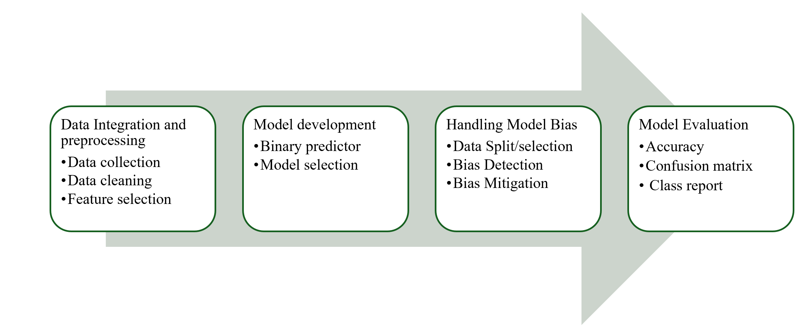

# Develop a predictive model for Alzheimer's disease using  proteomic and clinical data

This README tells the story of how I turned two raw data files into a working predictive pipeline for Alzheimer's disease. I wrote a set of focused notebooks to build the pipeline step by step, then combined them in [`Alzheimer_data_analysis_model_pipeline.ipynb`](Alzheimer_data_analysis_model_pipeline.ipynb) for a complete end-to-end run.

## Project Workflow

I started the project with two files: one containing proteomic intensity measurements and one containing clinical metadata. From there I preprocessed the proteomic measurements, merged the cleaned protein intensities with the clinical table, tried a simple binary classifier, and then addressed a major issue class imbalance before selecting a final model.

Overview of the two source files I worked with:
- Proteomic measurements: a matrix of protein intensities (proteins × samples)
- Clinical metadata: sample identifiers and patient attributes (age, sex, PMI, disease_group, batch, study, batch_org)

The notebook [`Alzheimer_data_analysis_model_pipeline.ipynb`](Alzheimer_data_analysis_model_pipeline.ipynb)contains the full, runnable pipeline: it loads the two files, runs the preprocessing steps, merges the tables, trains classifiers, applies sampling strategies to handle imbalance, and evaluates models. Below I explain how I arrived at that combined notebook by working through three focused notebooks.

1> [`Preprocess.ipynb`](Preprocess.ipynb) — Proteomic preprocessing (what I learned and did)

I began with [`Preprocess.ipynb`](Preprocess.ipynb) to clean and prepare the proteomic data. 
These are the steps I followed, learned from the course **Analysis of High-Throughput Datasets for Biologists**:

1. Installing all required packages for data analysis
2. Importing the packages and helper utilities
3. Setting file paths and exploring the raw datasets to understand shapes and headings
4. Preprocessing: renaming columns and separating the intensity columns from metadata
5. Log2 transformation of raw intensities to stabilize variance
6. Min–Max normalization to place features on a common scale
7. Removal of rows containing NaN values
8. Outlier detection and removal (Z-score thresholding)
9. Saving the processed proteomic intensity matrix
10. Integrating processed proteomic intensities with the clinical table

To learn more about these preprocessing steps, check out the proteomic data analysis repository 
[**Analysis of High-Throughput Datasets for Biologists**](https://github.com/LINK-TO-COURSE-REPO).

What this produced (intermediate results I watched as I worked):
- Raw proteomic matrix: 3870 × 119 (intensity columns + protein ID)
- After log transformation: 3870 × 118 (intensity columns only)
- After normalization and NaN removal: 3712 × 118
- After outlier removal: 3693 × 118 (processed intensity columns)
- Merged with the protein ID column → processed proteomic data 3693 × 119
- Clinical table: 118 × 8
- Final integrated table after joining clinical data: 118 × ~3700

---

2> [`binary_predictor.ipynb`](binary_predictor.ipynb) — First modeling attempt (what happened and why)

After preprocessing I tried a simple baseline model in `binary_predictor.ipynb` to get an initial sense of predictive signal.

Binary predictor steps:
1. Import libraries
2. Load the preprocessed dataset
3. Prepare data for modeling: X (all intensity values) and Y (binary target: AD or Control)
4. Train a logistic regression model
5. Evaluate the model

Data overview for modeling:
- Preprocessed dataset: 118 samples × ~3700 columns
- Feature matrix X: 118 × 3693
- Target Y: 118 × 1 (92 AD, 26 Control)
- Train/test split: 80% train (94), 20% test (24), random_state=42

Results and interpretation:
- Accuracy on the test set: 0.83
- Confusion matrix: 20 true negatives (TN), 4 false negatives (FN)
- The model predicted all 24 test samples as AD, showing a strong bias toward the majority class.

Takeaway: the baseline model performed reasonably on overall accuracy but failed to detect the minority class (Control). This motivated work on balancing strategies.

---

3> [`Balancing_data.ipynb`](Balancing_data.ipynb) — Handling class imbalance (what I tried)

I explored two strategies to correct class imbalance: oversampling (SMOTE) and undersampling.

Original data: 118 patients total (92 AD, 26 Control)

Oversampling (SMOTE): generated 66 synthetic control samples → 192 patients (96 AD, 96 Control). Observations:
- Logistic regression still struggled.
- Random Forest improved relative to logistic regression.
- Decision Tree performed well and was robust across sampling strategies.

Undersampling: downsampled the majority class to match controls → 52 patients (26 AD, 26 Control). Observations:
- Logistic regression and Random Forest dropped in performance (less training data hurts them).
- Decision Tree remained the most robust performer on the reduced dataset.

**Results**

| Model | Original Data (n=24) | SMOTE Oversampled (n=37) | Undersampled (n=11) |
|-------|---------------------|--------------------------|----------------------|
| **Logistic Regression** | `TP=20  FP=0` `FN=4   TN=0` **Accuracy: 0.83** | `TP=16  FP=3` `FN=5   TN=13` **Accuracy: 0.78** | `TP=4  FP=2` `FN=1  TN=4` **Accuracy: 0.72** |
| **Decision Tree** | `TP=19  FP=1` `FN=1   TN=3` **Accuracy: 0.91** | `TP=18  FP=1` `FN=2   TN=16` **Accuracy: 0.91** | `TP=5  FP=1` `FN=0  TN=5` **Accuracy: 0.90** |
| **Random Forest** | `TP=20  FP=0` `FN=4   TN=0` **Accuracy: 0.83** | `TP=17  FP=2` `FN=3   TN=15` **Accuracy: 0.86** | `TP=4  FP=2` `FN=2  TN=3` **Accuracy: 0.63** |

Across these experiments I kept track of accuracy, confusion matrices, and classification reports for each model and sampling strategy. The Decision Tree repeatedly emerged as the best single-model candidate in this dataset.

Packages I used for the project are listed in `Packages.txt`.

---

Full pipeline summary [`Alzheimer_data_analysis_model_pipeline.ipynb`](Alzheimer_data_analysis_model_pipeline.ipynb)

The combined notebook walks through the same steps in sequence so you can run the entire workflow from raw files to final evaluation:

1. Load proteomic and clinical datasets
2. Inspect dimensions and column names
3. Rename columns and select the intensity and ID fields
4. Apply log2 transformation to intensities
5. Apply Min–Max normalization
6. Visualize normalized data to check preprocessing
7. Remove rows with NaN values
8. Detect and remove outliers
9. Produce the processed proteomic matrix
10. Integrate processed proteomic and clinical data
11. Prepare modeling data (features and binary target)
12. Apply oversampling and undersampling to address class imbalance
13. Train models (Logistic Regression, Decision Tree, Random Forest)
14. Evaluate models and compare results
15. Select the best model (Decision Tree in these experiments)

---

This is my first internship project, where I got my first hands-on experience with machine learning models. Completed under the supervision of Prof. Dr. Dimitri Frischmann.
